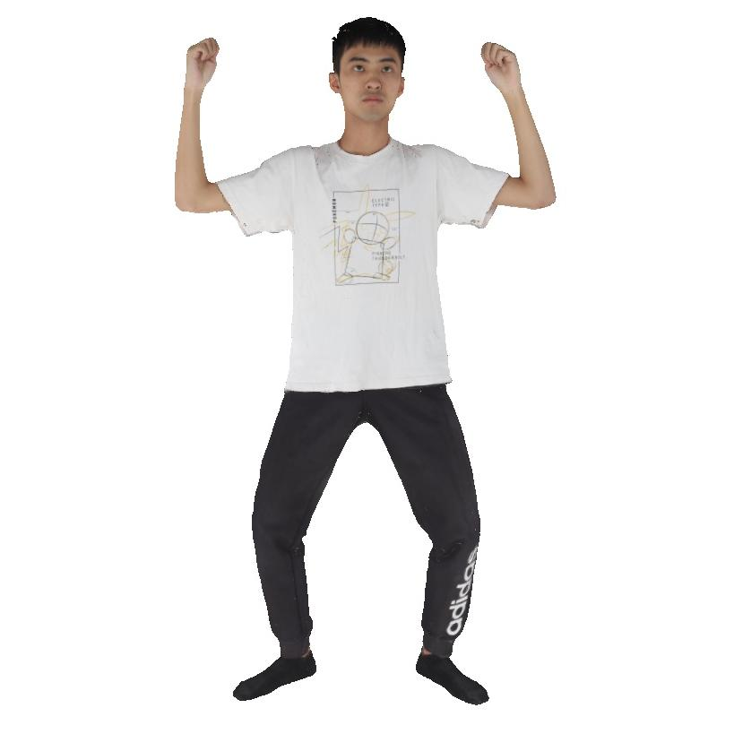
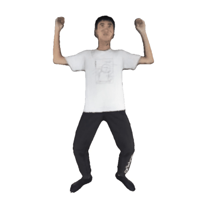
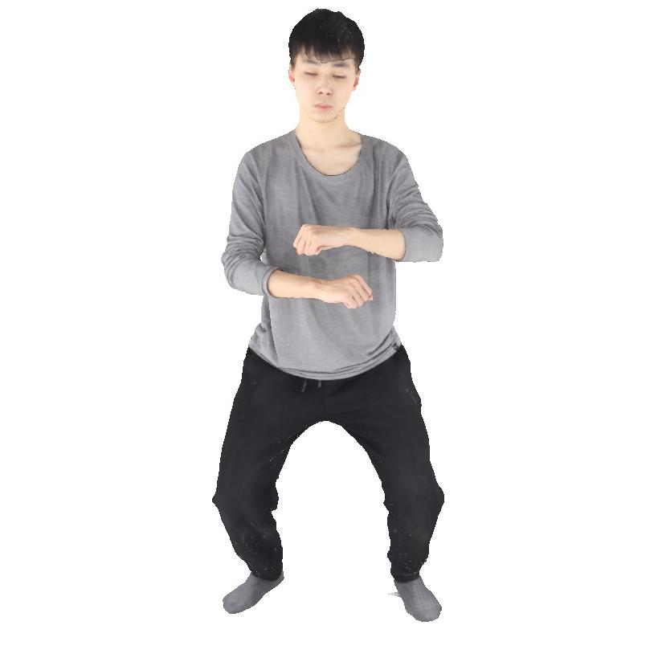
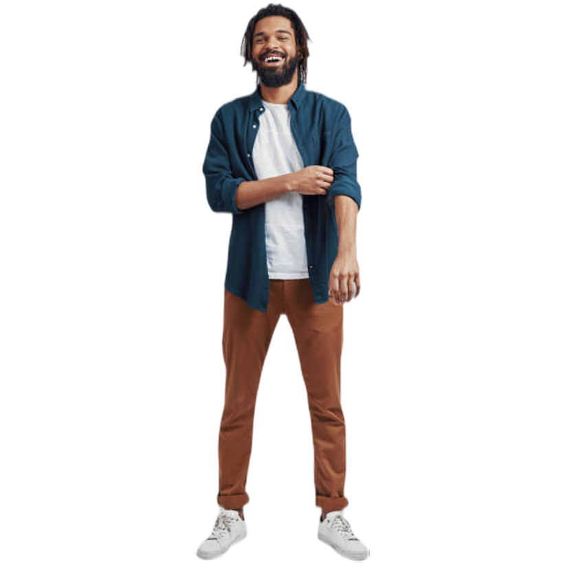
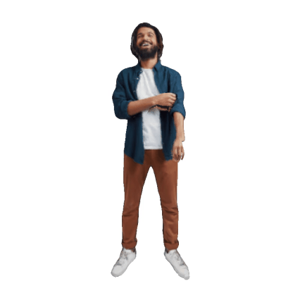
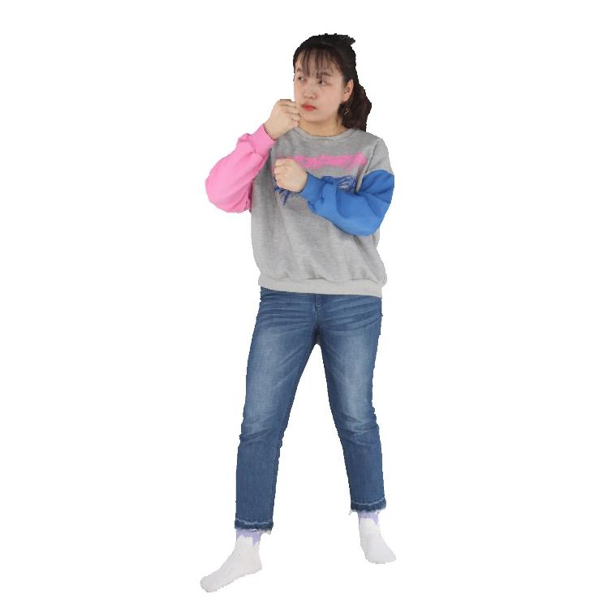
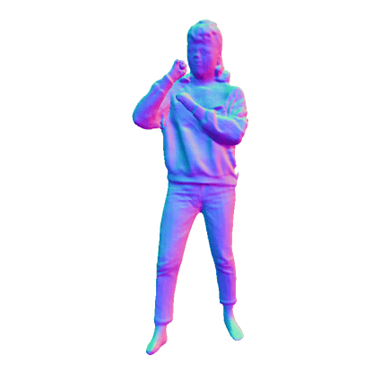
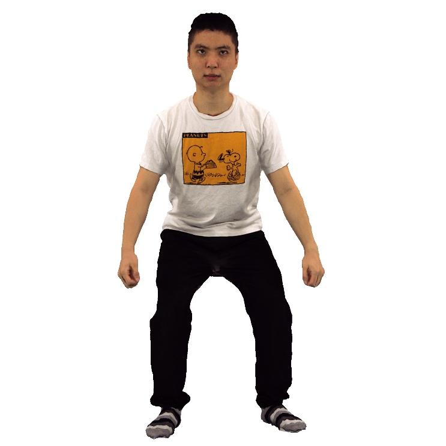

# SAT: Supervisor Regularization and Animation Augmentation for Two-process Monocular Texture 3D Human Reconstruction

The gallery of paper "SAT: Supervisor Regularization and Animation Augmentation for Two-process Monocular Texture 3D Human Reconstruction"

# Abstract

Monocular texture 3D human reconstruction aims to reconstruct the full 3D digital avatar from only one front-view human RGB image. However, the geometry ambiguity of the single 2D image and the scarcity of 3D human training data become the main factors limiting the development of this field. To solve these issues, current methods employed prior geometric estimation networks to obtain varied human geometric forms, like SMPL model, normal, and depth, but struggled to integrate these modalities effectively, leading to view-inconsistencies such as facial distortions. To this end, we propose a two-process 3D human reconstruction framework, SAT, which seamlessly learns various prior geometries in a united manner and reconstructs high-quality texture 3D avatars as the final. To further facilitate the geometry learning, we propose a Supervisor Feature Regularization module. By introducing a same-structure multi-view input network to offer the middle-layer features as training supervision, these varied geometric priors can be better fused. To tackle the data scarcity and further improve the reconstruction quality, we also propose an Online Animation
Augmentation module. By building a once-feed-forward animation network, we augment a massive amount of samples from the original 3D human data online for model training. Extensive quantitative and qualitative experiments on two benchmarks show the superiority of our approach compared to SOTA methods.

# Comparison with SOTA Methods

---

<table align="center" style="border-collapse: collapse; width: 100%;">
  <thead>
    <tr align="center">
      <th>Input Image</th>
      <th>Ours</th>
      <th>PSHuman</th>
      <th>GTA</th>
      <th>ICON</th>
    </tr>
  </thead>
  <tbody>
    <tr align="center">
      <td>
        
      </td>
      <td>
        
      </td>
      <td>
        
      </td>
      <td>
        
      </td>
      <td>
        
      </td>
    </tr>
    <tr align="center">
      <th>SiFU</th>
      <th>SiTH</th>
      <th>Human3diff</th>
      <th>PiFu</th>
      <th>ECON</th>
    </tr>
    <tr align="center">
      <td>
        
      </td>
      <td>
        
      </td>
      <td>
        
      </td>
      <td>
        
      </td>
      <td>
        
      </td>
    </tr>
  </tbody>
</table>

---

<table align="center" style="border-collapse: collapse; width: 100%;">
  <thead>
    <tr align="center">
      <th>Input Image</th>
      <th>Ours</th>
      <th>PSHuman</th>
      <th>GTA</th>
      <th>ICON</th>
    </tr>
  </thead>
  <tbody>
    <tr align="center">
      <td>
        
      </td>
      <td>
        
      </td>
      <td>
        
      </td>
      <td>
        
      </td>
      <td>
        
      </td>
    </tr>
    <tr align="center">
      <th>SiFU</th>
      <th>SiTH</th>
      <th>Human3diff</th>
      <th>PiFu</th>
      <th>ECON</th>
    </tr>
    <tr align="center">
      <td>
        
      </td>
      <td>
        
      </td>
      <td>
        
      </td>
      <td>
        
      </td>
      <td>
        
      </td>
    </tr>
  </tbody>
</table>

---

<table align="center" style="border-collapse: collapse; width: 100%;">
  <thead>
    <tr align="center">
      <th>Input Image</th>
      <th>Ours</th>
      <th>PSHuman</th>
      <th>GTA</th>
      <th>ICON</th>
    </tr>
  </thead>
  <tbody>
    <tr align="center">
      <td>
        
      </td>
      <td>
        
      </td>
      <td>
        
      </td>
      <td>
        
      </td>
      <td>
        
      </td>
    </tr>
    <tr align="center">
      <th>SiFU</th>
      <th>SiTH</th>
      <th>Human3diff</th>
      <th>PiFu</th>
      <th>ECON</th>
    </tr>
    <tr align="center">
      <td>
        
      </td>
      <td>
        
      </td>
      <td>
        
      </td>
      <td>
        
      </td>
      <td>
        
      </td>
    </tr>
  </tbody>
</table>

---

<table align="center" style="border-collapse: collapse; width: 100%;">
  <thead>
    <tr align="center">
      <th>Input Image</th>
      <th>Ours</th>
      <th>PSHuman</th>
      <th>GTA</th>
      <th>ICON</th>
    </tr>
  </thead>
  <tbody>
    <tr align="center">
      <td>
        
      </td>
      <td>
        
      </td>
      <td>
        
      </td>
      <td>
        
      </td>
      <td>
        
      </td>
    </tr>
    <tr align="center">
      <th>SiFU</th>
      <th>SiTH</th>
      <th>Human3diff</th>
      <th>PiFu</th>
      <th>ECON</th>
    </tr>
    <tr align="center">
      <td>
        
      </td>
      <td>
        
      </td>
      <td>
        
      </td>
      <td>
        
      </td>
      <td>
        
      </td>
    </tr>
  </tbody>
</table>

---

<table align="center" style="border-collapse: collapse; width: 100%;">
  <thead>
    <tr align="center">
      <th>Input Image</th>
      <th>Ours</th>
      <th>PSHuman</th>
      <th>GTA</th>
      <th>ICON</th>
    </tr>
  </thead>
  <tbody>
    <tr align="center">
      <td>
        
      </td>
      <td>
        
      </td>
      <td>
        
      </td>
      <td>
        
      </td>
      <td>
        
      </td>
    </tr>
    <tr align="center">
      <th>SiFU</th>
      <th>SiTH</th>
      <th>Human3diff</th>
      <th>PiFu</th>
      <th>ECON</th>
    </tr>
    <tr align="center">
      <td>
        
      </td>
      <td>
        
      </td>
      <td>
        
      </td>
      <td>
        
      </td>
      <td>
        
      </td>
    </tr>
  </tbody>
</table>

---

<table align="center" style="border-collapse: collapse; width: 100%;">
  <thead>
    <tr align="center">
      <th>Input Image</th>
      <th>Ours</th>
      <th>PSHuman</th>
      <th>GTA</th>
      <th>ICON</th>
    </tr>
  </thead>
  <tbody>
    <tr align="center">
      <td>
        
      </td>
      <td>
        
      </td>
      <td>
        
      </td>
      <td>
        
      </td>
      <td>
        
      </td>
    </tr>
    <tr align="center">
      <th>SiFU</th>
      <th>SiTH</th>
      <th>Human3diff</th>
      <th>PiFu</th>
      <th>ECON</th>
    </tr>
    <tr align="center">
      <td>
        
      </td>
      <td>
        
      </td>
      <td>
        
      </td>
      <td>
        
      </td>
      <td>
        
      </td>
    </tr>
  </tbody>
</table>

---

<table align="center" style="border-collapse: collapse; width: 100%;">
  <thead>
    <tr align="center">
      <th>Input Image</th>
      <th>Ours</th>
      <th>PSHuman</th>
      <th>GTA</th>
      <th>ICON</th>
    </tr>
  </thead>
  <tbody>
    <tr align="center">
      <td>
        
      </td>
      <td>
        
      </td>
      <td>
        
      </td>
      <td>
        
      </td>
      <td>
        
      </td>
    </tr>
    <tr align="center">
      <th>SiFU</th>
      <th>SiTH</th>
      <th>Human3diff</th>
      <th>PiFu</th>
      <th>ECON</th>
    </tr>
    <tr align="center">
      <td>
        
      </td>
      <td>
        
      </td>
      <td>
        
      </td>
      <td>
        
      </td>
      <td>
        
      </td>
    </tr>
  </tbody>
</table>

---

<table align="center" style="border-collapse: collapse; width: 100%;">
  <thead>
    <tr align="center">
      <th>Input Image</th>
      <th>Ours</th>
      <th>PSHuman</th>
      <th>SiTH</th>
      <th>GTA</th>
      <th>ICON</th>
    </tr>
  </thead>
  <tbody>
    <tr align="center">
      <td>
        
      </td>
      <td>
        
      </td>
      <td>
        
      </td>
      <td>
        
      </td>
      <td>
        
      </td>
      <td>
        
      </td>
    </tr>
    <tr align="center">
      <th>SiFU</th>
      <th>VS</th>
      <th>HiLo</th>
      <th>Human3diff</th>
      <th>PiFu</th>
      <th>ECON</th>
    </tr>
    <tr align="center">
      <td>
        
      </td>
      <td>
        
      </td>
        <td>
        
      </td>
      <td>
        
      </td>
      <td>
        
      </td>
      <td>
        
      </td>
    </tr>
  </tbody>
</table>

---

<table align="center" style="border-collapse: collapse; width: 100%;">
  <thead>
    <tr align="center">
      <th>Input Image</th>
      <th>Ours</th>
      <th>PSHuman</th>
      <th>SiTH</th>
      <th>GTA</th>
      <th>ICON</th>
    </tr>
  </thead>
  <tbody>
    <tr align="center">
      <td>
        
      </td>
      <td>
        
      </td>
      <td>
        
      </td>
      <td>
        
      </td>
      <td>
        
      </td>
      <td>
        
      </td>
    </tr>
    <tr align="center">
      <th>SiFU</th>
      <th>VS</th>
      <th>HiLo</th>
      <th>Human3diff</th>
      <th>PiFu</th>
      <th>ECON</th>
    </tr>
    <tr align="center">
      <td>
        
      </td>
      <td>
        
      </td>
        <td>
        
      </td>
      <td>
        
      </td>
      <td>
        
      </td>
      <td>
        
      </td>
    </tr>
  </tbody>
</table>

---

<table align="center" style="border-collapse: collapse; width: 100%;">
  <thead>
    <tr align="center">
      <th>Input Image</th>
      <th>Ours</th>
      <th>PSHuman</th>
      <th>SiTH</th>
      <th>GTA</th>
      <th>ICON</th>
    </tr>
  </thead>
  <tbody>
    <tr align="center">
      <td>
        
      </td>
      <td>
        
      </td>
      <td>
        
      </td>
      <td>
        
      </td>
      <td>
        
      </td>
      <td>
        
      </td>
    </tr>
    <tr align="center">
      <th>SiFU</th>
      <th>VS</th>
      <th>HiLo</th>
      <th>Human3diff</th>
      <th>PiFu</th>
      <th>ECON</th>
    </tr>
    <tr align="center">
      <td>
        
      </td>
      <td>
        
      </td>
        <td>
        
      </td>
      <td>
        
      </td>
      <td>
        
      </td>
      <td>
        
      </td>
    </tr>
  </tbody>
</table>

---

<table align="center" style="border-collapse: collapse; width: 100%;">
  <thead>
    <tr align="center">
      <th>Input Image</th>
      <th>Ours</th>
      <th>PSHuman</th>
      <th>SiTH</th>
      <th>GTA</th>
      <th>ICON</th>
    </tr>
  </thead>
  <tbody>
    <tr align="center">
      <td>
        
      </td>
      <td>
        
      </td>
      <td>
        
      </td>
      <td>
        
      </td>
      <td>
        
      </td>
      <td>
        
      </td>
    </tr>
    <tr align="center">
      <th>SiFU</th>
      <th>VS</th>
      <th>HiLo</th>
      <th>Human3diff</th>
      <th>PiFu</th>
      <th>ECON</th>
    </tr>
    <tr align="center">
      <td>
        
      </td>
      <td>
        
      </td>
        <td>
        
      </td>
      <td>
        
      </td>
      <td>
        
      </td>
      <td>
        
      </td>
    </tr>
  </tbody>
</table>

# More Examples

<table align="center">
  <tr align="center">
    <td align="center">
      
    </td>
    <td align="center">
      
    </td>
    <td align="center">
      
    </td>
  </tr>
</table>

---

<table align="center">
  <tr align="center">
    <td align="center">
      
    </td>
    <td align="center">
      
    </td>
    <td align="center">
      
    </td>
  </tr>
</table>

---

<table align="center">
  <tr align="center">
    <td align="center">
      
    </td>
    <td align="center">
      
    </td>
    <td align="center">
      
    </td>
  </tr>
</table>

---

<table align="center">
  <tr align="center">
    <td align="center">
      
    </td>
    <td align="center">
      
    </td>
    <td align="center">
      
    </td>
  </tr>
</table>

# Animation

<table align="center">
  <tr align="center">
    <td align="center">
      
    </td>
    <td align="center">
      
    </td>
    <td align="center">
      
    </td>
    <td align="center">
      
    </td>
    <td align="center">
      
    </td>
  </tr>
</table>

# How Ours Works

We introduce a novel framework, SAT, for the task of monocular texture 3D human reconstruction, which comprises two key processes: United Geometry Learning (UGL) and Cascading Gaussian Texturing (CGT). Central to these processes are two innovative modules: Supervised Feature Regularization (SFR) and Online Animation Augmentation (OAA). In the UGL process, we extract different-modality geometric features from the input image using various prior models and integrate them into a united geometric learning network for reconstructing 3D human normal Gaussians. To enhance this process, the SFR module is employed. It involves training a multi-view supervisor model that generates multi-level supervisor feature maps, which serve as a regularizing force for monocular geometry learning. The CGT process aims to align with the output distribution of the UGL process while preventing cascading errors. It utilizes the 3D geometry human Gaussian derived from UGL, alongside the input image, to reconstruct the 3D texture Gaussian. To further boost reconstruction quality and address the limited availability of human 3D data, we introduce the OAA module. This module trains an animation model that dynamically generates more pose-varied 3D human samples, augmenting the existing dataset for enhanced model training.
