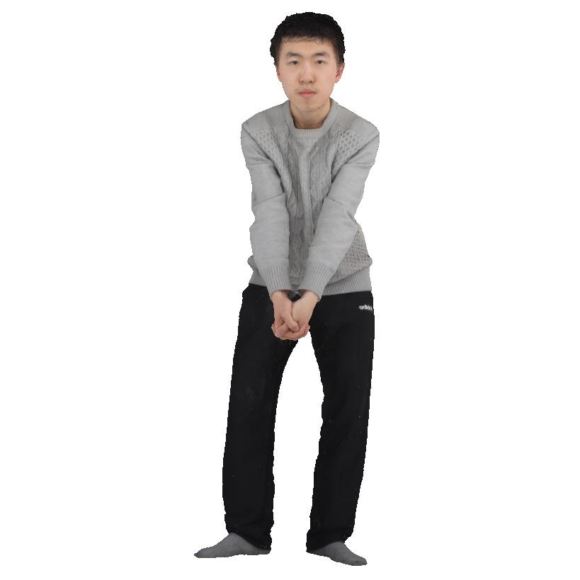

# Ours: Towards Multi-Level Geometry Learning for Monocular 3D Textured Human Reconstruction

The gallery of paper "Ours: Towards Multi-Level Geometry Learning for Monocular 3D Textured Human Reconstruction"

# Abstract

This paper investigates the research task of reconstructing the 3D clothed human body from a monocular image. Due to the inherent ambiguity of single-view input, existing approaches leverage pre-trained SMPL(-X) estimation models or generative models to provide auxiliary information for human reconstruction. However, these methods capture only the general human body geometry and overlook specific geometric details, leading to inaccurate skeleton reconstruction, incorrect joint positions, and unclear cloth wrinkles. In response to these issues, we propose a multi-level geometry learning framework. Technically, we design three key components: skeleton-level enhancement, joint-level augmentation, and wrinkle-level refinement modules. Specifically, we effectively integrate the projected 3D Fourier features into a Gaussian reconstruction model, introduce perturbations to improve joint depth estimation during training, and refine the human coarse wrinkles by resembling the de-noising process of diffusion model. Extensive quantitative and qualitative experiments on two out-of-distribution test sets show the superior performance of our approach compared to state-of-the-art (SOTA) methods. 

# Texture Comparison with SOTA Methods

<table align="center" style="border-collapse: collapse; width: 100%;">
  <thead>
    <tr align="center">
      <th>Input Image</th>
      <th>Ours</th>
      <th>PSHuman</th>
      <th>GTA</th>
      <th>ICON</th>
    </tr>
  </thead>
  <tbody>
    <tr align="center">
      <td>
        
      </td>
      <td>
        
      </td>
      <td>
        
      </td>
      <td>
        
      </td>
      <td>
        
      </td>
    </tr>
    <tr align="center">
      <th>SiFU</th>
      <th>SiTH</th>
      <th>Human3diff</th>
      <th>PiFu</th>
      <th>ECON</th>
    </tr>
    <tr align="center">
      <td>
        
      </td>
      <td>
        
      </td>
      <td>
        
      </td>
      <td>
        
      </td>
      <td>
        
      </td>
    </tr>
  </tbody>
</table>

---

<table align="center" style="border-collapse: collapse; width: 100%;">
  <thead>
    <tr align="center">
      <th>Input Image</th>
      <th>Ours</th>
      <th>PSHuman</th>
      <th>GTA</th>
      <th>ICON</th>
    </tr>
  </thead>
  <tbody>
    <tr align="center">
      <td>
        
      </td>
      <td>
        
      </td>
      <td>
        
      </td>
      <td>
        
      </td>
      <td>
        
      </td>
    </tr>
    <tr align="center">
      <th>SiFU</th>
      <th>SiTH</th>
      <th>Human3diff</th>
      <th>PiFu</th>
      <th>ECON</th>
    </tr>
    <tr align="center">
      <td>
        
      </td>
      <td>
        
      </td>
      <td>
        
      </td>
      <td>
        
      </td>
      <td>
        
      </td>
    </tr>
  </tbody>
</table>

## Comparisions on Human Geometry

<table align="center">
  <tr align="center">
    <td align="center">
      
      
<strong>Input Image</strong>

    </td>
    <td align="center">
      
      
<strong>Ours</strong>

    </td>
    <td align="center">
      
      
<strong>HiLo</strong>

    </td>
    <td align="center">
      
      
<strong>VS</strong>

    </td>
  </tr>
  <tr align="center">
    <td align="center">
      
      
<strong>SiTH</strong>

    </td>
    <td align="center">
      
      
<strong>SiFU</strong>

    </td>
    <td align="center">
      
      
<strong>ICON</strong>

    </td>
    <td align="center">
      
      
<strong>GTA</strong>

    </td>
  </tr>
</table>

---

<table align="center">
  <tr align="center">
    <td align="center">
      
      
<strong>Input Image</strong>

    </td>
    <td align="center">
      
      
<strong>Ours</strong>

    </td>
    <td align="center">
      
      
<strong>HiLo</strong>

    </td>
    <td align="center">
      
      
<strong>VS</strong>

    </td>
  </tr>
  <tr align="center">
    <td align="center">
      
      
<strong>SiTH</strong>

    </td>
    <td align="center">
      
      
<strong>SiFU</strong>

    </td>
    <td align="center">
      
      
<strong>ICON</strong>

    </td>
    <td align="center">
      
      
<strong>GTA</strong>

    </td>
  </tr>
</table>

---

<table align="center">
  <tr align="center">
    <td align="center">
      
      
<strong>Input Image</strong>

    </td>
    <td align="center">
      
      
<strong>Ours</strong>

    </td>
    <td align="center">
      
      
<strong>HiLo</strong>

    </td>
    <td align="center">
      
      
<strong>VS</strong>

    </td>
  </tr>
  <tr align="center">
    <td align="center">
      
      
<strong>SiTH</strong>

    </td>
    <td align="center">
      
      
<strong>SiFU</strong>

    </td>
    <td align="center">
      
      
<strong>ICON</strong>

    </td>
    <td align="center">
      
      
<strong>GTA</strong>

    </td>
  </tr>
</table>

---

<table align="center">
  <tr align="center">
    <td align="center">
      
      
<strong>Input Image</strong>

    </td>
    <td align="center">
      
      
<strong>Ours</strong>

    </td>
    <td align="center">
      
      
<strong>HiLo</strong>

    </td>
    <td align="center">
      
      
<strong>VS</strong>

    </td>
  </tr>
  <tr align="center">
    <td align="center">
      
      
<strong>SiTH</strong>

    </td>
    <td align="center">
      
      
<strong>SiFU</strong>

    </td>
    <td align="center">
      
      
<strong>ICON</strong>

    </td>
    <td align="center">
      
      
<strong>GTA</strong>

    </td>
  </tr>
</table>

---

<table align="center">
  <tr align="center">
    <td align="center">
      
      
<strong>Input Image</strong>

    </td>
    <td align="center">
      
      
<strong>Ours</strong>

    </td>
    <td align="center">
      
      
<strong>HiLo</strong>

    </td>
    <td align="center">
      
      
<strong>VS</strong>

    </td>
  </tr>
  <tr align="center">
    <td align="center">
      
      
<strong>SiTH</strong>

    </td>
    <td align="center">
      
      
<strong>SiFU</strong>

    </td>
    <td align="center">
      
      
<strong>ICON</strong>

    </td>
    <td align="center">
      
      
<strong>GTA</strong>

    </td>
  </tr>
</table>

---

# Examples of Human Avatar

# Visualization for Ablation Study
## Visualizations on WLR Module

We provide further insights into the impact of the WLR module by comparing results before and after its implementation. The results clearly illustrate that the WLR module significantly enhances the geometric quality of the reconstructed mesh, particularly in capturing intricate details such as clothing wrinkles and facial features. The first row shows the normal map that has not been processed by the WLR module, while the second row shows the optimized normal map.

---

## Visualizations on SLE Module

We presents additional results that highlight the effects of incorporating the Skeleton-Level Enhancement (SLE) module. The comparison reveals that the SLE module effectively aids in reconstructing the target human geometry, resulting in a reconstructed mesh that closely resembles the ground truth (GT) mesh. The first row illustrates our method without the SLE module, while the second row shows our methods incorporating this module. The last rows present the GT for reference.

---

# Animatable 3D Avatars

<table align="center">
  <tr align="center">
    <td align="center">
      
    </td>
    <td align="center">
      
    </td>
    <td align="center">
      
    </td>
    <td align="center">
      
    </td>
  </tr>
  <tr align="center">
    <td align="center">
      
    </td>
    <td align="center">
      
    </td>
    <td align="center">
      
    </td>
    <td align="center">
      
    </td>
  </tr>
</table>

# How Ours Works

Our method, Ours, addresses monocular textured 3D human reconstruction by introducing a multi-level geometry learning framework that significantly enhances reconstruction quality. To accurately capture the human body's posture, we propose the SLE module, which projects 3D Fourier features into the 2D space of the input image, allowing the Gaussian reconstruction model to fully utilize prior human shape knowledge. For improved depth estimation of human joints, the JLA strategy applies controlled perturbations during training, increasing the model's robustness to depth inaccuracies during inference. To refine geometric details like body wrinkles, the WLR module resembles the final de-noising steps in diffusion theory, treating coarse meshes as Gaussian noise and using the high-quality texture of reconstructed Gaussian as conditions to refine wrinkles.
